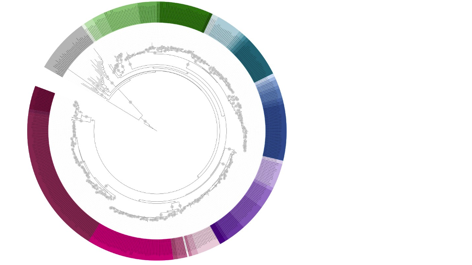
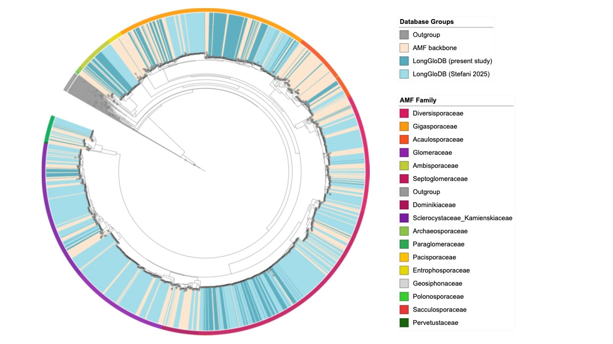

Welcome to **GloDB**! Here, you can find resources related to arbusuclar mycorrhizal fungal (AMF) LSU and long-read (SSU-ITS-LSU) databases and associated pipelines. The databases rely on sequencing from culture collections, and are curated in collaboration with taxonomists. The LSU pipelines allow placement of study sequences into a LSU backbone tree to identify putative AMF, and family and genera. These can be implemented for OTU or ASV assignment, and now can be run in or out of cluster environment. 

**GloDB Backbone tree.** A visualization of the latest curated large subunit (LSU) database backbone tree, including more than 400 tips with updated taxonomy. Colors show AMF genera (with grey representing outgroups).

**Large subunit tree from curated long-read database LongGloDB.** Large subunit (LSU) phylogenetic tree of the GloDB. The LSU region was extracted from the PacBio long-reads to place them into the previously developed backbone LSU tree. Colors show database groups (GloDB outgroup, Geosiphonaceae, and backbone sequences as well as PacBio-derived LongGloDB LSU sequences from the present study and Stefani et al.(2025)) and AMF family.

## Database and pipeline references

When using this resource, please cite the relevant paper(s):

- Delavaux, C. S. et al. Utility of large subunit for environmental sequencing of arbuscular mycorrhizal fungi: a new reference database and pipeline. New Phytologist 229, 3048–3052 (2021). 
- Delavaux, C. S., Ramos, R. J., Sturmer, S. L. & Bever, J. D. Environmental identification of arbuscular mycorrhizal fungi using the LSU rDNA gene region: an expanded database and improved pipeline. Mycorrhiza 32, 145–153 (2022). 
- Delavaux, C. S., Ramos, R. J., Stürmer, S. L. & Bever, J. D. An updated LSU database and pipeline for environmental DNA identification of arbuscular mycorrhizal fungi. Mycorrhiza, 1–5 (2024). 
